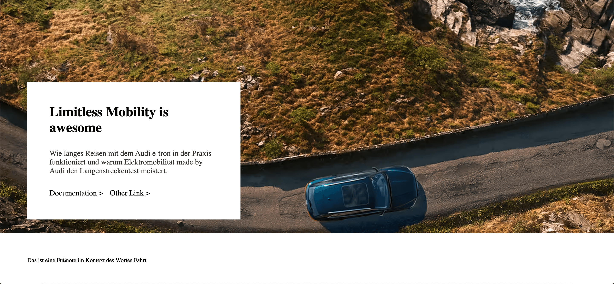

# Content Fragment REST API Preview Demo

Demo app to showcase the Content Fragment Editor Preview with Next.js and React Server components using the Content Fragment REST API. 

The app handles previews of one to many Feature Apps based on a given Content Fragment ID for an author instance. Feature Apps are mapped to a Content Fragment Model and to a React Server Component.   

The [Next.js](https://nextjs.org/) project was bootstrapped with [`create-next-app`](https://github.com/vercel/next.js/tree/canary/packages/create-next-app).

 

## Project Structure

- **app/[[...slug]]/page.tsx**: optional catch-all host page with layout, head and error handling 
- **conf**: defines supported feature apps and their mapping plus the demo page CF id fallback
- **feature-apps**: feature app components (react server components)
- **utils**: utility functions to query and resolve content fragments     

## Env & Auth

Create an `.env` file similar to `.env.example` and fill out the author instance host and token env variables to be able to connect to the author instance.

See [Local Development Access Token](https://experienceleague.adobe.com/docs/experience-manager-learn/getting-started-with-aem-headless/authentication/local-development-access-token.html?lang=en) to obtain an access token or run the following JS snippet on experience.adobe.com if you're in a hurry:

```js
for (const key in window.sessionStorage) {
  if (key.startsWith('adobeid_ims_access_token')) {
    const {client_id, tokenValue: value} = JSON.parse(window.sessionStorage[key]);
    if (client_id === 'exc_app') {
      console.log(value)
    }
    break;
  }
}
```

## Content Fragment examples

For the demo, sample Content Fragments Models and example content were created in this [folder](https://experience.adobe.com/?repo=author-p98108-e908839.adobeaemcloud.com#/@audiag/aem/cf/admin/content/dam/live-preview/en). 

Content Fragment Models: 
- [Feature App 1](https://author-p98108-e908839.adobeaemcloud.com/ui#/aem/mnt/overlay/dam/cfm/models/editor/content/editor.html/conf/Live-Preview-Hackathon/settings/dam/cfm/models/feature-app-1): mapped to ParallaxTeaser  
- [Feature App 2](https://author-p98108-e908839.adobeaemcloud.com/ui#/aem/mnt/overlay/dam/cfm/models/editor/content/editor.html/conf/Live-Preview-Hackathon/settings/dam/cfm/models/feature-app-2): mapped to SequenceScroll  
- [Landing Page](https://author-p98108-e908839.adobeaemcloud.com/ui#/aem/mnt/overlay/dam/cfm/models/editor/content/editor.html/conf/Live-Preview-Hackathon/settings/dam/cfm/models/landing-page): which can reference multiple Feature Apps  

With corresponding examples:
- [Feature App 1 Example](https://experience.adobe.com/?repo=author-p98108-e908839.adobeaemcloud.com#/@audiag/aem/cf/editor/editor/content%2Fdam%2Flive-preview%2Fen%2Fcontent-fragment) with model *Feature App 1*
- [Feature App 2 Example](https://experience.adobe.com/?repo=author-p98108-e908839.adobeaemcloud.com#/@audiag/aem/cf/editor/editor/content%2Fdam%2Flive-preview%2Fen%2Ffeature-app-2-example) with model *Feature App 2*
- [Landing Page Example](https://experience.adobe.com/?repo=author-p98108-e908839.adobeaemcloud.com#/@audiag/aem/cf/editor/editor/content%2Fdam%2Flive-preview%2Fen%2Flanding-page-example) with model *Landing Page*  


Feature App 1 Example URL: http://localhost:3000/feature-app/6f005bec-9cde-4cd2-827d-578a3a33a514

Landing Page Example URL: http://localhost:3000/page/d6ca53d5-c11b-4d66-a270-fd43c9aee899 

## Getting Started

First, run the development server:

```bash
npm run dev
# or
yarn dev
# or
pnpm dev
```

Open [http://localhost:3000](http://localhost:3000) with your browser to see the result.


## Learn More

To learn more about Next.js, take a look at the following resources:

- [Next.js Documentation](https://nextjs.org/docs) - learn about Next.js features and API.
- [Learn Next.js](https://nextjs.org/learn) - an interactive Next.js tutorial.

You can check out [the Next.js GitHub repository](https://github.com/vercel/next.js/) - your feedback and contributions are welcome!

## Deploy on Vercel

The easiest way to deploy your Next.js app is to use the [Vercel Platform](https://vercel.com/new?utm_medium=default-template&filter=next.js&utm_source=create-next-app&utm_campaign=create-next-app-readme) from the creators of Next.js.

Check out our [Next.js deployment documentation](https://nextjs.org/docs/deployment) for more details.
